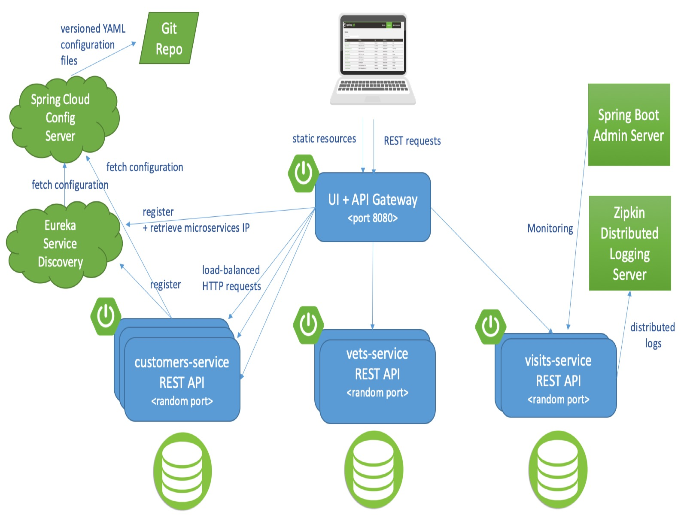

# ATB-PFE

    

# Advantages
Single Source of Truth: Having all shared models and DTOs in one place (shared-module) ensures that there is a single source of truth, reducing duplication and inconsistency.
Modularity: Other modules remain focused on their domain-specific logic while reusing common models from the shared-module.
Ease of Maintenance: Updates to shared models and DTOs only need to be made in one place, making the system easier to maintain and evolve.
Avoiding Circular Dependencies: By ensuring the shared-module is independent and lightweight, you avoid the risk of circular dependencies that could arise from tightly coupling modules.
This approach should work well as long as the shared-module is carefully managed to avoid unnecessary complexity. It promotes a clean architecture with a clear separation of concerns.

